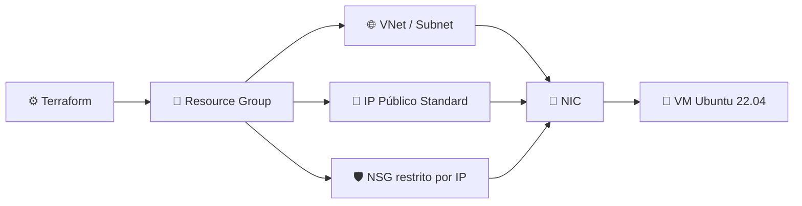

<div align="center">

# ☁️ Lab Terraform: Azure VM 🏗️

### Infraestrutura como código, do zero à VM rodando na nuvem


</div>

---

## 📋 Sumário

- [☁️ Sobre o projeto](#️-sobre-o-projeto)
- [🧱 O que é provisionado](#-o-que-é-provisionado)
- [🗺️ Arquitetura](#️-arquitetura)
- [📐 Estrutura base do Terraform](#-estrutura-base-do-terraform)
- [🧰 Pré-requisitos](#-pré-requisitos)
- [⚙️ Como usar](#️-como-usar)
- [🐛 Erros enfrentados e causa raiz](#-erros-enfrentados-e-causa-raiz)
- [🔒 Boas práticas de segurança aplicadas](#-boas-práticas-de-segurança-aplicadas)
- [🛰️ Próximos passos](#️-próximos-passos)

---

## ☁️ Sobre o projeto

Lab pessoal de infraestrutura como código: provisiona uma **VM Ubuntu Server na Azure via Terraform**, usando os créditos do GitHub Student Developer Pack (Azure for Students).

> 🖥️ **Ambiente:** Arch Linux, VS Code (extensão HashiCorp Terraform), `terraform` CLI e `azure-cli`

---

## 🧱 O que é provisionado

| Recurso | Descrição |
|---|---|
| 🏢 Resource Group | Container lógico de todos os recursos |
| 🌐 Virtual Network + Subnet | Rede isolada na Azure |
| 📡 IP Público | Estático, SKU Standard |
| 🔌 Network Interface (NIC) | Conecta a VM à rede |
| 🛡️ Network Security Group | Regra de entrada SSH restrita por IP de origem |
| 🐧 VM Linux (Ubuntu 22.04 LTS) | Com script de inicialização (`setup.sh`) |

---

## 🗺️ Arquitetura



---

## 📐 Estrutura base do Terraform

Todo projeto Terraform segue o mesmo esqueleto de 3 blocos, independente do provider (`azurerm`, `aws`, `google`...):

1. 📦 `terraform{}`: declara qual provider usar e trava a versão.
2. 🔑 `provider{}`: configura como o Terraform autentica/fala com a nuvem.
3. 🧩 `resource{}`: o que de fato existe na infra.

Isso não é específico de Azure, é a estrutura padrão da ferramenta.

---

## 🧰 Pré-requisitos

- ✅ `terraform` instalado
- ✅ `azure-cli` instalado e autenticado (`az login`)
- ✅ Chave SSH gerada (`~/.ssh/id_rsa` ou similar), recomenda-se protegida com passphrase

---

## ⚙️ Como usar

```bash
# 1. Copie o arquivo de exemplo e preencha com seus valores reais
cp terraform.tfvars.example terraform.tfvars

# 2. Descubra seu IP público IPv4 (pra restringir o SSH)
curl -4 ifconfig.me

# 3. Inicialize, formate e valide
terraform init
terraform fmt -recursive
terraform validate

# 4. Veja o plano antes de aplicar
terraform plan

# 5. Aplique
terraform apply
```

> ⚠️ **Nunca** comite o `terraform.tfvars` real, ele fica de fora do Git via `.gitignore`.

---

## 🐛 Erros enfrentados e causa raiz

<details>
<summary><strong>1. 🔐 az login falhando (AADSTS50076 / AADSTS530035)</strong></summary>

**Causa:** política de "Security Defaults" do Microsoft Entra ID bloqueia login CLI de dispositivo não registrado no domínio.

**Fix:** `az login --use-device-code` ou desativar Security Defaults em Entra ID → Properties → Manage security defaults (aceitável em lab pessoal, sem risco corporativo).
</details>

<details>
<summary><strong>2. ⚠️ Error: Unsupported argument: resource_provider_registrations</strong></summary>

**Causa:** esse atributo só existe no provider azurerm 4.x. Com `version = "~> 3.0"`, a sintaxe correta é `skip_provider_registration = true`.

**Lição:** sempre conferir a versão do provider travada em `required_providers` antes de copiar sintaxe de docs/erros.
</details>

<details>
<summary><strong>3. 🚫 Error: creating Virtual Network ... RequestDisallowedByAzure (403)</strong></summary>

**Causa:** contas de assinatura de estudante têm uma Azure Policy que restringe as regiões permitidas. Não é limitação do Terraform, é da conta.

**Fix, pra descobrir as regiões liberadas direto na fonte:**
```bash
az policy assignment list | grep -A 15 '"listOfAllowedLocations"'
```

Regiões liberadas nesta conta de estudante: `canadacentral`, `mexicocentral`, `brazilsouth`, `northcentralus`, `eastus2` (brazilsouth costuma não ter capacidade gratuita disponível na prática).
</details>

<details>
<summary><strong>4. 📦 Error: 409 SkuNotAvailable</strong></summary>

**Causa:** falta de capacidade física do datacenter para aquele tamanho de VM naquele momento, comum com a família B (B1s/B2s), a mais disputada por ser a gratuita.

**Fix:** trocar apenas o `size`, tentando outra família (B2s, D2s_v3 etc). Nunca trocar a `location` só por causa disso, isso força destroy+create de RG/VNet/NIC à toa (ver item 5).
</details>

<details>
<summary><strong>5. 🔄 State dessincronizado após trocar location</strong></summary>

**Causa raiz:** `azurerm_subnet` não tem atributo `location` (herda da VNet pai). Ao mudar a `location` do Resource Group, o Terraform recria RG → VNet → NIC (que têm `location` explícito), mas não recalcula a Subnet como "a recriar", porque nada no bloco dela mudou. Na Azure, quando a VNet pai é destruída, a Subnet morre em cascata: o `.tfstate` local não sabe disso. Resultado: próximo apply tenta usar uma subnet/VNet que já não existe → erros 400/404.

**Fix:**
```bash
terraform destroy -auto-approve
terraform state list      # deve voltar vazio
terraform apply -auto-approve
```

**Regra prática:** trocar região equivale a sempre esperar um ciclo completo de destroy antes de aplicar de novo. Não empilhar troca de `size` e `location` no mesmo apply.
</details>

<details>
<summary><strong>6. 🧬 Standard_B2ats_v2 incompatível com a imagem</strong></summary>

**Causa:** o sufixo `a` no nome da SKU indica arquitetura ARM (Ampere). A imagem Ubuntu declarada (`22_04-lts-gen2`) é x64, juntar as duas quebra na hora de anexar o disco do SO.

**Lição:** ao trocar `size` por causa de capacidade, prefira famílias x64 de uso geral (D-series) em vez de variantes ARM, a menos que a imagem também seja ARM.

**Fix que funcionou:** `Standard_D2s_v3`, família D (uso geral, x64), quase sempre com capacidade sobrando por ser voltada ao mercado corporativo.
</details>

<details>
<summary><strong>7. 🌐 Error: 400 IPv4BasicSkuPublicIpCountLimitReached</strong></summary>

**Causa:** a Microsoft está descontinuando a SKU "Basic" de IP público e zerou a cota dela para assinaturas novas/estudante. `allocation_method = "Dynamic"` num `azurerm_public_ip` sem `sku` explícito cai automaticamente em Basic.

**Fix:** declarar `sku = "Standard"`, que por sua vez exige `allocation_method = "Static"` (Standard não aceita IP dinâmico).
</details>

<details>
<summary><strong>8. 📤 Output do IP vindo vazio logo após o apply</strong></summary>

**Causa:** encadear o output através de `azurerm_linux_virtual_machine.vm.public_ip_address` depende do Terraform atualizar esse atributo computado na VM a partir da NIC a partir do IP. Essa cadeia indireta nem sempre resolve a tempo de imprimir no mesmo apply.

**Fix:** apontar o output direto para a fonte primária, `azurerm_public_ip.this.ip_address`, sem passar pela VM.
</details>

<details>
<summary><strong>9. 🔌 SSH "travado"/sem resposta mesmo com IP público</strong></summary>

**Causa:** a Azure não libera nenhuma porta de entrada por padrão. Sem um Network Security Group associado à placa de rede, o tráfego externo (incluindo a porta 22) é descartado silenciosamente e o terminal fica esperando indefinidamente, sem erro explícito.

**Fix:** criar um `azurerm_network_security_group` com uma `security_rule` liberando a porta 22 (Inbound/Allow/Tcp) e associá-lo à NIC via `azurerm_network_interface_security_group_association`.
</details>

---

## 🔒 Boas práticas de segurança aplicadas

- 🚫 **Nenhum segredo versionado.** `.gitignore` cobre `*.tfstate`, `*.tfstate.*`, `.terraform/`, `terraform.tfvars`. Só o `terraform.tfvars.example` (com valores genéricos) vai para o Git.
- 🎯 **NSG restrito por IP.** `source_address_prefix` do NSG usa `var.allowed_ssh_ip` (CIDR `/32` do IP de origem) em vez de `"*"`, evitando expor a porta 22 para a internet inteira. Aceitável abrir para `"*"` só em lab de poucas horas com `destroy` planejado no final; para algo mais duradouro, sempre restrinja ao IP de origem.
- 🧩 **Sem hardcode de infraestrutura pessoal.** Usuário admin, caminho da chave SSH e IP autorizado ficam em variáveis, não fixos no `main.tf`, facilitando o reuso do template sem expor dados específicos do autor original.
- 🔑 **Chave privada SSH protegida por passphrase** (`ssh-keygen -p -f ~/.ssh/id_rsa`), mitigando o risco de uso indevido da chave em caso de comprometimento do disco/máquina.
- 📬 Chave **pública** SSH (`.pub`) não é segredo, pode ser referenciada livremente por caminho. O que nunca pode ser versionado ou exposto é a chave **privada**.

---

## 🛰️ Próximos passos

- [x] Validar acesso SSH na VM, confirmado e funcionando de ponta a ponta ✅
- [x] ~~Migrar Wazuh para essa VM~~ (trocado de rota: foco em infra/cloud, não SIEM)
- [ ] Subir **Prometheus + Grafana** na VM (observabilidade/métricas)

---

<div align="center">

Feito com 🐧 + ☕ + muito `terraform apply`

</div>
